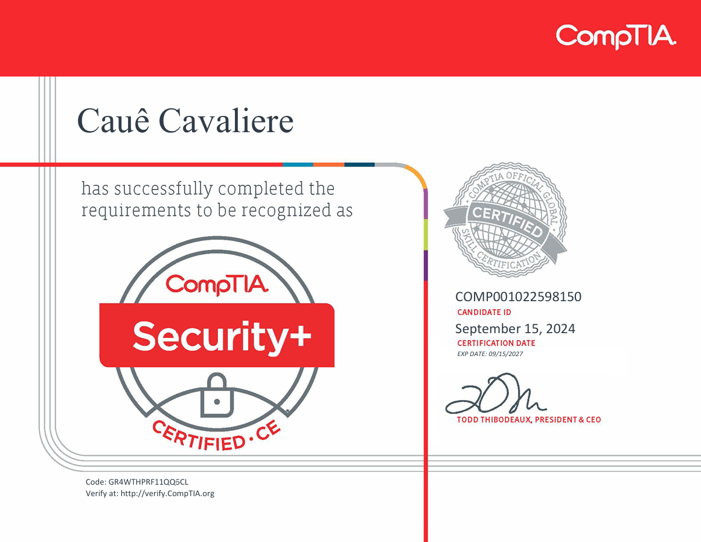

# CompTIA Security+ SY0-701

>  I took the [Security+ certification](https://www.comptia.org/certificacoes/security) from [CompTIA](https://www.linkedin.com/company/comptia), I didn't follow the common path that is study based on the Security+ Ebook  ([Self-Paced Study Guide](https://www.comptia.org/training/books/security-sy0-701-study-guide)). Here is what I did to pass the exam **paying less to learn**.

## 📚 Actually learn

The Security+ exam it is really tricky, but if you don't have technical knowledge you would even understand the question and possible answers, so for this I recommend you do this:

| Platform | Course/Content Name                                                                  | Created by                     | Comments                                      |
|:---------| :------------------------------------------------------------------------------------| :------------------------------| :---------------------------------------------|
| Udemy    | [CompTIA Security+ SY0-701 Full Course, Labs, and Study Plan](https://bit.ly/3Xwr4tq)| TIA Education, Andrew Ramdayal | I didn't watch the Labs section of the course |
| Udemy    | [CompTIA Security+ SY0-701: The Ultimate Practice Exam 2024](https://bit.ly/4eoz0Ux) | Serkan Demirhan                |                                               |
| ChatGPT  | [Research](https://https://chatgpt.com/)                                             | OpenIA                         |                                               |

### 1. CompTIA Security+ SY0-701 Full Course, Labs, and Study Plan

You will learn 90% of all topics required for the exam with this course.

⚠ SKIP THE MOCK EXAM AT THE END OF THE COURSE DURING THIS STEP!!!

### 2. CompTIA Security+ SY0-701: The Ultimate Practice Exam 2024

These practice exams are really technical with way less need for interpretation than the real exam, so focus on learn acronyms and all topics you never heard about it.

### 3. Research

Some moments you will have doubts and the platform that most helped me was ChatGPT, example of prompt: 
`What is the difference between MOU and MOA for Comptia Security+ 701?`

## 🧠 Understand the context of the questions